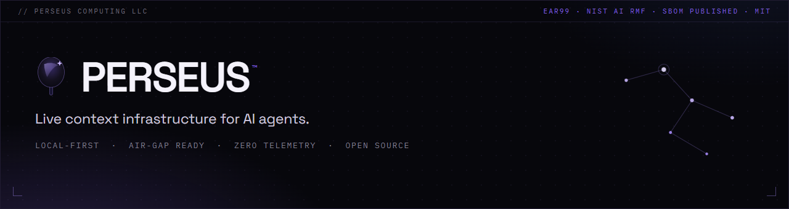
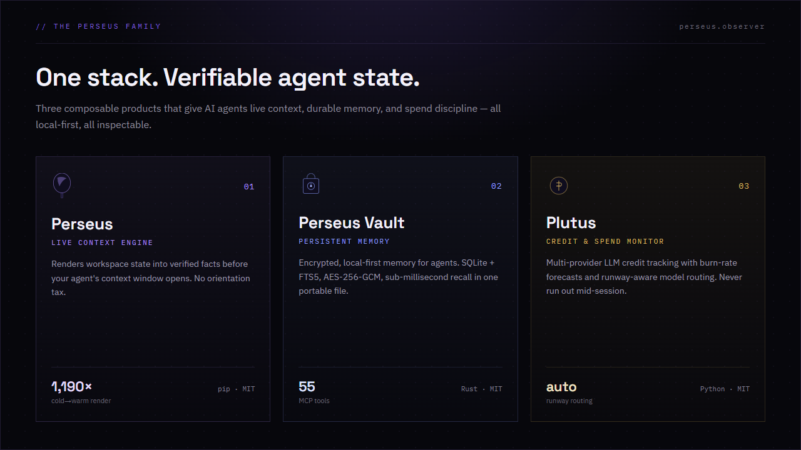

  

 

  
  
  

---

## The Perseus family

  

### [Perseus](https://github.com/Perseus-Computing-LLC/perseus) — Live Context Engine
Renders workspace state into verified facts before your AI agent's context window opens. No orientation tax. No stale docs. Just instant, inspectable context. `pip install perseus-ctx`. MIT licensed. Local-first.

### [Perseus Vault](https://github.com/Perseus-Computing-LLC/perseus-vault) — Persistent Memory
Zero-dependency, encrypted persistent memory for AI agents (formerly "Mimir"/"Mnēmē"). SQLite + FTS5, AES-256-GCM, sub-millisecond recall in one portable file. 55 MCP tools. Single Rust binary.

### [Plutus](https://github.com/Perseus-Computing-LLC/plutus) — Credit &amp; Spend Monitor
Multi-provider LLM credit tracking with burn-rate forecasts and runway-aware model routing. Never run out mid-session. `pip install plutus-agent`. MIT licensed.

---

## More from Perseus Computing

### [MCTS](https://github.com/Perseus-Computing-LLC/MCTS) — Security Scanner
Model Context Threat Scanner. Local-first static and live analysis for MCP servers. 30+ analyzers catching injection, exposed secrets, and unverified tool inputs. JSON, SARIF, and HTML output. Run it before you trust an MCP server.

### [PR Pilot](https://github.com/Perseus-Computing-LLC/pr-pilot) — Autonomous Review
5-agent pipeline: reviewer → fixer → tester → verifier → escalator. Autonomous PR review that finds bugs, writes fixes, verifies deployments, and escalates when blocked.

### [Blast Radius](https://github.com/Perseus-Computing-LLC/blast-radius-agent) — Impact Analysis
GitLab Orbit-powered dependency graph analyzer. See exactly what breaks before you change code.

---

## For Government

[Government procurement page →](https://perseus.observer/government/)

- SBOMs published per EO 14028
- NIST AI RMF aligned (all four functions)
- EAR99 self-classified — no ITAR restrictions
- Air-gap ready — zero cloud dependencies
- MIT licensed — no vendor lock-in
